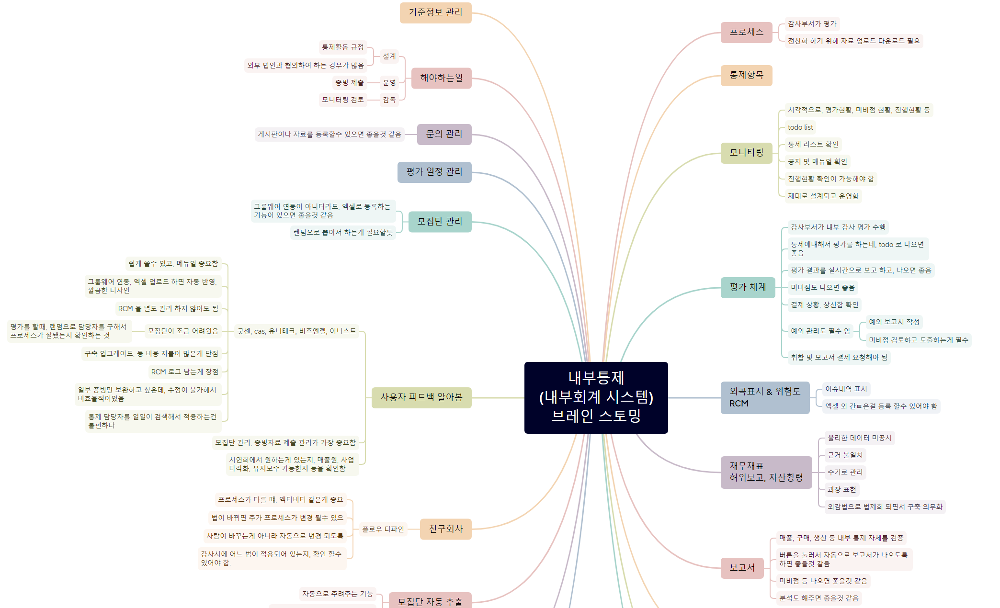

# 사용하게 된 계기

회사에서 진행중인 프로젝트 중에 방향이나 계획 같은게 아직 세워지기전인 녀석이 있습니다.

그래서 브레인스토밍이라는걸 해보자 했었습니다.

그때 XMind를 깔아서 진행을 하였습니다.

만들어진 파일명이 `xmind` 인데, 이게 Xmind 에서만 열리지 싶습니다.

# 설치

[XMind](https://xmind.app/) 여기에 들어가서 설치하면 될 것 같은데, 사실 저는 이미 설치가 되어 있었습니다.

별다른 설정 없이 next만 눌렀을것으로 생각이 됩니다.

# 사용

사용은 새로 만들기 해서 사용하시면 됩니다.

아래 그림은 브레인스토밍하면서 실제로 작성한 파일의 캡쳐 이미지 입니다.

깔아놓고도 왜 이제야 썻을까 하는 생각이 들었고, 꼭 업무용이 아니더라도 활용도는 무궁무진하지 않을까 생각이 들었기에,
따로 시간을 내여 blog 글을 작성하게 되었습니다.

딱히 사용이 어렵지 않고, 매우 직관적이었기 때문에, 더 설명할 내용도 없을것 같습니다.

한번 써보시길 바랍니다. 